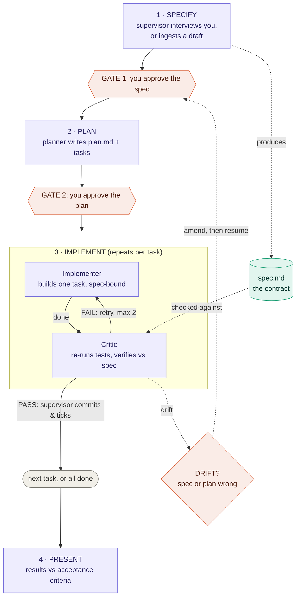

# spec-swarm

A reusable, guided spec-driven development workflow for Claude Code: a
supervisor skill that interviews you into a spec, then dispatches a small
agent team (planner → implementer → critic) to deliver it task by task,
with you approving each phase gate.

Inspired by Spec Kit's specify → plan → tasks → implement phases and the
planner/doer/critic/supervisor role model for agent teams.

## How it works



**The roles**

- **You (human):** approve each gate. Nothing advances without your sign-off, and scope never changes silently.
- **Supervisor (the skill):** interview or ingest a draft, run the gates, dispatch the agents, commit each verified task, escalate drift.
- **Planner:** turn the approved spec into `plan.md` + a task breakdown. Plans only, never writes code.
- **Implementer:** build exactly one task, bound to the spec. Never commits.
- **Critic:** independently re-run the tests and judge each task (PASS / FAIL / DRIFT). Verifies, never fixes.

The **spec is the contract**: planner, implementer, and critic all work against it, and the critic verifies every task against its acceptance criteria.

## Install

As a plugin, pick one:

This plugin lives in the `spec-swarm/` subfolder of the
[lunatech-sdd-workflows](https://github.com/lunatech-labs/lunatech-sdd-workflows)
mono-repo, so the plugin path points at that subfolder, not the repo root.

```bash
# Per-session (good for development; /reload-plugins picks up edits)
claude --plugin-dir /path/to/lunatech-sdd-workflows/spec-swarm

# Auto-loaded in every session: put it in your skills directory
cp -r spec-swarm ~/.claude/skills/spec-swarm

# Or distribute via a plugin marketplace for /plugin install
```

Note: plugin skills/commands are namespaced — invoke as `/spec-swarm:sdd`.

Or copy into one project (un-namespaced `/sdd`):

```bash
cp -r spec-swarm/agents/* your-repo/.claude/agents/
cp -r spec-swarm/skills/* your-repo/.claude/skills/
cp -r spec-swarm/commands/* your-repo/.claude/commands/
```

## Use

```
/sdd add CSV export to the reports page    # start a new spec
/sdd                                       # resume an in-progress spec
```

Or just describe a feature — the skill offers itself for anything bigger
than ~30 minutes of work.

Not sure whether a change is worth the full pipeline? See
[When to use the SDD pipeline vs. make changes directly](docs/guidelines-sdd-vs-direct-edits.md).

## What lives where

| Path | Role |
|------|------|
| `skills/spec-swarm/SKILL.md` | the workflow + supervisor/presenter |
| `skills/spec-swarm/templates/spec.md` | spec template (the contract) |
| `agents/sdd-planner.md` | spec → plan.md + task breakdown |
| `agents/sdd-implementer.md` | one task per dispatch, spec-bound |
| `agents/sdd-critic.md` | independent PASS/FAIL/DRIFT verification |
| `commands/sdd.md` | `/sdd` entry point |

Per-project state lives under `specs/NNN-slug/` (spec.md, plan.md,
journal.md) — the plugin itself stays project-agnostic.

The `specs/` folder is written **relative to the directory your Claude Code
session is running in**, not inside the plugin. So if you launch Claude Code
from `~/code/my-app` and run `/sdd add CSV export`, the spec lands at:

```
~/code/my-app/specs/001-add-csv-export/
├── spec.md
├── plan.md
└── journal.md
```

Run the session from a different repo and the `specs/` folder follows you
there.

Each new `/sdd` run creates its own sequentially numbered folder
(`001-`, `002-`, `003-`, …) rather than overwriting the last one. Over time
`specs/` becomes an ordered record of the work — each folder a self-contained
contract, plan, and journal — giving you visibility into how the project has
evolved:

```
~/code/my-app/specs/
├── 001-add-csv-export/
├── 002-bracketed-paste-support/
└── 003-spec-critic-lint/
```

## Design notes

- **You fill what only you know** (mission, outcome, scope, constraints,
  acceptance criteria); agents fill the rest. Out-of-scope and acceptance
  criteria are deliberately pushed hard in the interview.
- **Hard gates.** Nothing advances a phase without your approval.
- **Independent verification.** The critic re-runs tests itself and judges
  against the spec, not the implementer's claims.
- **Drift is escalated, never absorbed.** Spec problems found mid-build go
  to you via journal.md, not silently patched around.
- **Parallel-ready.** Tasks carry `depends_on:` so independent tasks can
  later run in parallel worktrees; execution is sequential for now.

